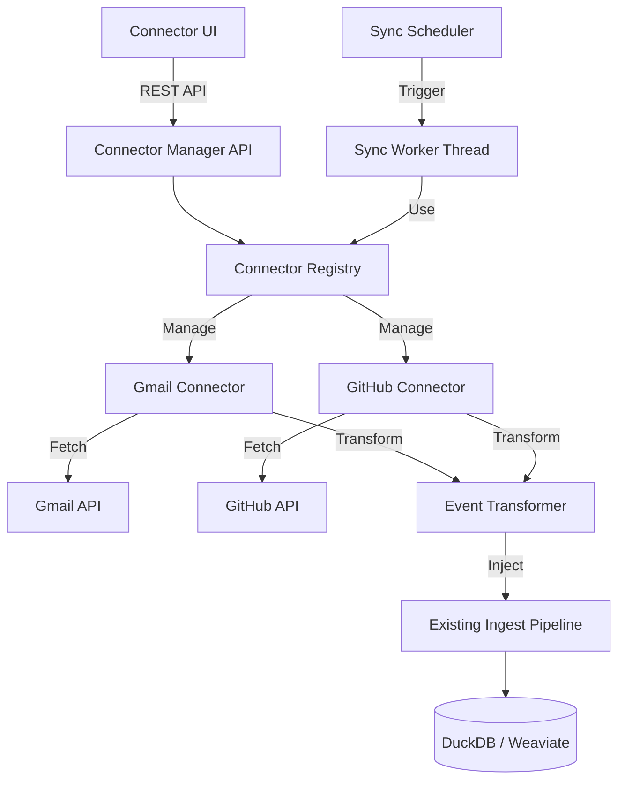
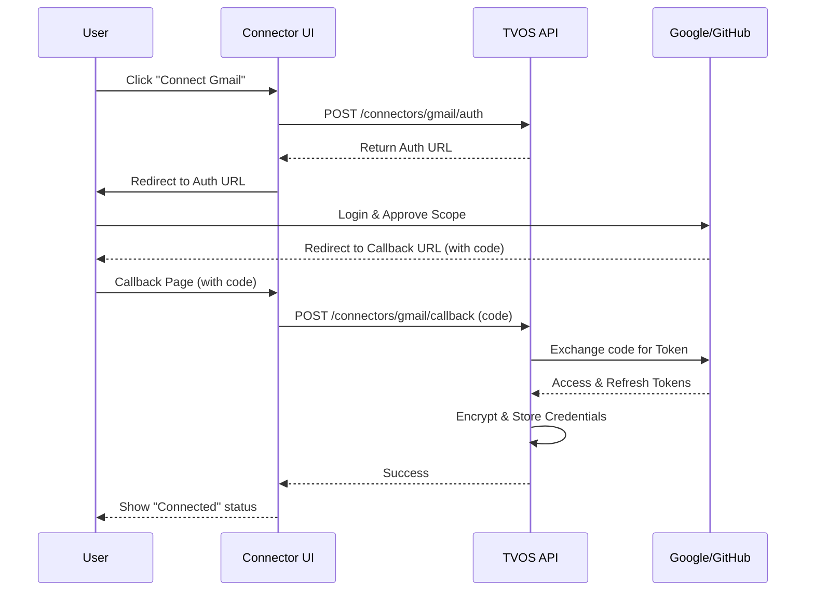

# External Connectors Design Document

## Overview

The External Connectors feature extends TVOS's event ingestion capabilities to include data from third-party services like Gmail and GitHub. This design introduces a plugin-based connector architecture that integrates seamlessly with TVOS's existing event pipeline while maintaining the system's local-first philosophy and temporal semantic analytics capabilities.

The connector system consists of four main components:
1. **Connector Registry** - Manages available connectors and their lifecycle
2. **Connector Implementations** - Service-specific integrations (Gmail, GitHub, etc.)
3. **Sync Scheduler** - Orchestrates periodic and manual sync jobs
4. **Connector UI** - User interface for managing integrations

All external events flow through the same ingestion pipeline as local events, ensuring consistent storage, embedding generation, and analytics processing.

## Architecture

### High-Level Architecture



### Integration with Existing TVOS Architecture

The connector system integrates at the event ingestion layer:

1. **Sync Worker Thread** - New background worker (similar to ingest, embed, analytics workers)
2. **Event Injection** - Connectors create EventPayload protobuf messages and inject them into the existing pipeline
3. **Metadata Tagging** - External events are tagged with connector source in the `source` field and additional metadata
4. **Shared Storage** - All events (local and external) use the same DuckDB tables and Weaviate collections

## Components and Interfaces

### 1. Connector Base Interface

All connectors implement a standard interface:

```python
from abc import ABC, abstractmethod
from typing import List, Dict, Any, Optional
from datetime import datetime

class ConnectorBase(ABC):
    """Base class for all external connectors"""
    
    @property
    @abstractmethod
    def name(self) -> str:
        """Unique connector identifier (e.g., 'gmail', 'github')"""
        pass
    
    @property
    @abstractmethod
    def display_name(self) -> str:
        """Human-readable name (e.g., 'Gmail', 'GitHub')"""
        pass
    
    @abstractmethod
    def get_auth_url(self) -> str:
        """Returns OAuth URL for user authentication"""
        pass
    
    @abstractmethod
    def authenticate(self, auth_code: str) -> Dict[str, Any]:
        """
        Exchanges auth code for credentials
        Returns: {"access_token": "...", "refresh_token": "...", ...}
        """
        pass
    
    @abstractmethod
    def fetch_events(
        self, 
        credentials: Dict[str, Any],
        since: Optional[datetime] = None,
        filters: Optional[Dict[str, Any]] = None
    ) -> List[Dict[str, Any]]:
        """
        Fetches events from external service
        Returns: List of raw external events
        """
        pass
    
    @abstractmethod
    def transform_event(self, raw_event: Dict[str, Any]) -> 'EventPayload':
        """
        Transforms external event to TVOS EventPayload
        Returns: EventPayload protobuf message
        """
        pass
    
    def validate_credentials(self, credentials: Dict[str, Any]) -> bool:
        """Validates that credentials are still valid"""
        return True
    
    def get_rate_limit_info(self) -> Dict[str, int]:
        """Returns rate limit information"""
        return {"requests_per_hour": 1000, "requests_per_day": 10000}
```

### 2. Connector Registry

Manages connector lifecycle and configuration:

```python
class ConnectorRegistry:
    """Central registry for all connectors"""
    
    def __init__(self):
        self._connectors: Dict[str, ConnectorBase] = {}
        self._db = get_db_connection()
        self._redis = redis.Redis(...)
        self._crypto = CredentialEncryption()
    
    def register(self, connector: ConnectorBase) -> None:
        """Register a new connector type"""
        pass
    
    def get_connector(self, name: str) -> Optional[ConnectorBase]:
        """Get connector instance by name"""
        pass
    
    def list_connectors(self) -> List[Dict[str, Any]]:
        """List all available connectors with status"""
        pass
    
    def save_credentials(self, connector_name: str, user_id: str, credentials: Dict) -> None:
        """Encrypt and store credentials"""
        pass
    
    def get_credentials(self, connector_name: str, user_id: str) -> Optional[Dict]:
        """Retrieve and decrypt credentials"""
        pass
    
    def delete_credentials(self, connector_name: str, user_id: str) -> None:
        """Remove stored credentials"""
        pass
```

### 3. Sync Scheduler

Orchestrates sync jobs:

```python
class SyncScheduler:
    """Manages scheduled and manual sync jobs"""
    
    def schedule_sync(
        self, 
        connector_name: str,
        user_id: str,
        interval_minutes: int
    ) -> str:
        """Schedule periodic sync job, returns job_id"""
        pass
    
    def trigger_manual_sync(
        self,
        connector_name: str,
        user_id: str
    ) -> str:
        """Trigger immediate sync, returns job_id"""
        pass
    
    def cancel_sync(self, job_id: str) -> bool:
        """Cancel running or scheduled sync"""
        pass
    
    def get_sync_status(self, job_id: str) -> Dict[str, Any]:
        """Get status of sync job"""
        pass
```

### 4. Gmail Connector Implementation

```python
class GmailConnector(ConnectorBase):
    """Gmail integration using Google OAuth and Gmail API"""
    
    name = "gmail"
    display_name = "Gmail"
    
    def __init__(self):
        self.client_id = Config.GMAIL_CLIENT_ID
        self.client_secret = Config.GMAIL_CLIENT_SECRET
        self.scopes = ["https://www.googleapis.com/auth/gmail.readonly"]
    
    def fetch_events(self, credentials, since=None, filters=None):
        """Fetch emails using Gmail API"""
        # Use google-api-python-client
        # Query: after:{timestamp} label:{filter}
        pass
    
    def transform_event(self, raw_event):
        """Transform Gmail message to EventPayload"""
        # Extract: subject, from, body snippet, timestamp
        # Create EventPayload with source="gmail"
        pass
```

### 5. GitHub Connector Implementation

```python
class GitHubConnector(ConnectorBase):
    """GitHub integration using OAuth or Personal Access Token"""
    
    name = "github"
    display_name = "GitHub"
    
    def __init__(self):
        self.client_id = Config.GITHUB_CLIENT_ID
        self.client_secret = Config.GITHUB_CLIENT_SECRET
    
    def fetch_events(self, credentials, since=None, filters=None):
        """Fetch repository events using GitHub API"""
        # Events: commits, PRs, issues, comments
        # Use PyGithub library
        pass
    
    def transform_event(self, raw_event):
        """Transform GitHub event to EventPayload"""
        # Extract: type, repo, author, message, timestamp
        # Create EventPayload with source="github"
        pass
```

## Data Models

### Database Schema Extensions

```sql
-- Connector configurations table
CREATE TABLE IF NOT EXISTS connector_configs (
    id VARCHAR PRIMARY KEY,
    user_id VARCHAR,  -- For multi-user support (future)
    connector_name VARCHAR,
    enabled BOOLEAN,
    sync_interval_minutes INTEGER,
    filters JSON,  -- Connector-specific filters
    created_at TIMESTAMP,
    updated_at TIMESTAMP
);

-- Encrypted credentials table
CREATE TABLE IF NOT EXISTS connector_credentials (
    id VARCHAR PRIMARY KEY,
    user_id VARCHAR,
    connector_name VARCHAR,
    encrypted_data BLOB,  -- AES-256 encrypted credentials
    iv BLOB,  -- Initialization vector for encryption
    created_at TIMESTAMP,
    updated_at TIMESTAMP
);

-- Sync job history
CREATE TABLE IF NOT EXISTS sync_jobs (
    job_id VARCHAR PRIMARY KEY,
    connector_name VARCHAR,
    user_id VARCHAR,
    status VARCHAR,  -- 'pending', 'running', 'completed', 'failed'
    started_at TIMESTAMP,
    completed_at TIMESTAMP,
    events_synced INTEGER,
    error_message TEXT,
    sync_type VARCHAR  -- 'scheduled', 'manual'
);

-- Sync state (cursor/checkpoint for incremental sync)
CREATE TABLE IF NOT EXISTS sync_state (
    connector_name VARCHAR,
    user_id VARCHAR,
    last_sync_timestamp BIGINT,
    cursor VARCHAR,  -- Service-specific cursor (e.g., Gmail historyId)
    metadata JSON,
    PRIMARY KEY (connector_name, user_id)
);
```

### Event Metadata Extensions

External events include additional metadata in the `metadata` field:

```json
{
  "connector": "gmail",
  "external_id": "msg_abc123",
  "sync_job_id": "job_xyz789",
  "synced_at": 1234567890,
  "connector_metadata": {
    "from": "user@example.com",
    "to": ["recipient@example.com"],
    "labels": ["INBOX", "IMPORTANT"]
  }
}
```

### API Models

```python
class ConnectorStatus(BaseModel):
    name: str
    display_name: str
    enabled: bool
    connected: bool
    last_sync: Optional[datetime]
    next_sync: Optional[datetime]
    event_count: int
    sync_interval_minutes: Optional[int]

class ConnectorConfig(BaseModel):
    connector_name: str
    enabled: bool
    sync_interval_minutes: int
    filters: Dict[str, Any]

class SyncJobStatus(BaseModel):
    job_id: str
    connector_name: str
    status: str
    started_at: datetime
    completed_at: Optional[datetime]
    events_synced: int
    error_message: Optional[str]
```

## Correctness Properties

*A property is a characteristic or behavior that should hold true across all valid executions of a system-essentially, a formal statement about what the system should do. Properties serve as the bridge between human-readable specifications and machine-verifiable correctness guarantees.*

Based on the prework analysis, I've identified the following testable properties while eliminating redundancies:

### Property 1: OAuth flow returns valid authentication URL
*For any* connector that supports OAuth, initiating authentication should return a valid OAuth URL containing required parameters (client_id, redirect_uri, scope)
**Validates: Requirements 1.1, 2.1**

### Property 2: Credential encryption round-trip
*For any* credentials dictionary, encrypting then decrypting should return the original credentials unchanged, and the encrypted form should not contain plaintext credential values
**Validates: Requirements 1.2, 2.2, 6.1, 6.3**

### Property 3: Incremental sync respects timestamps
*For any* connector and last sync timestamp, fetching events should only return events with timestamps after the last sync timestamp
**Validates: Requirements 1.3, 2.3**

### Property 4: Gmail transformation completeness
*For any* Gmail email object, the Event Transformer should produce an EventPayload where the text_payload contains the subject and body, metadata contains sender information, and source equals "gmail"
**Validates: Requirements 1.4**

### Property 5: GitHub transformation completeness
*For any* GitHub event object (commit, PR, issue), the Event Transformer should produce an EventPayload where text_payload contains the event description, metadata contains repository and author information, and source equals "github"
**Validates: Requirements 2.4**

### Property 6: Sync scheduling respects intervals
*For any* enabled connector with a configured sync interval, the scheduler should create sync jobs at the specified frequency (within a reasonable tolerance)
**Validates: Requirements 1.5, 7.2**

### Property 7: Rate limit backoff increases delays
*For any* connector that encounters rate limit responses, subsequent retry attempts should have exponentially increasing delays
**Validates: Requirements 2.5**

### Property 8: Connector status includes required fields
*For any* registered connector, querying its status should return an object containing last_sync_timestamp, sync_interval_minutes, event_count, and enabled fields
**Validates: Requirements 3.2**

### Property 9: Disconnect removes credentials
*For any* connected connector, disconnecting should remove stored credentials and set enabled to false
**Validates: Requirements 3.4**

### Property 10: Sync progress is queryable
*For any* running sync job, querying its status should return current progress information including status, started_at, and events_synced
**Validates: Requirements 3.5**

### Property 11: Manual sync creates job
*For any* connector, triggering manual sync should create a new sync job with status='pending' or 'running' and sync_type='manual'
**Validates: Requirements 4.1**

### Property 12: Concurrent sync prevention
*For any* connector with a running sync job, attempting to start another sync should return an error and not create a duplicate job
**Validates: Requirements 4.2**

### Property 13: Sync completion updates timestamp
*For any* completed sync job, the connector's last_sync_timestamp should be updated to the completion time
**Validates: Requirements 4.3**

### Property 14: Sync failure records error
*For any* failed sync job, the job record should have status='failed' and error_message should be non-empty
**Validates: Requirements 4.4, 9.1**

### Property 15: Running sync is cancellable
*For any* sync job with status='running', calling cancel should change its status to 'cancelled' and stop further processing
**Validates: Requirements 4.5**

### Property 16: Connector exception isolation
*For any* connector that raises an exception during sync, the Connector System should catch it, log the error, and continue operating without crashing
**Validates: Requirements 5.5**

### Property 17: Configuration persistence round-trip
*For any* connector configuration (interval, filters, enabled), saving then loading the configuration should return the same values
**Validates: Requirements 7.3**

### Property 18: Rate limit adaptation
*For any* connector that exceeds rate limits repeatedly, the sync interval should automatically increase
**Validates: Requirements 7.4**

### Property 19: Disabled sync stops scheduling
*For any* connector, setting enabled=false should prevent new scheduled sync jobs while preserving stored credentials
**Validates: Requirements 7.5**

### Property 20: Source filtering accuracy
*For any* event query with a source filter, all returned events should have a source field matching the filter value
**Validates: Requirements 8.2**

### Property 21: Drift analysis supports source grouping
*For any* drift analysis request with source grouping, results should be segmented by event source
**Validates: Requirements 8.5**

### Property 22: Authentication failure marks re-auth needed
*For any* connector that encounters authentication errors during sync, the connector status should indicate re-authentication is required
**Validates: Requirements 9.2**

### Property 23: Network error retry with backoff
*For any* connector that encounters transient network errors, the system should retry with exponential backoff up to a maximum number of attempts
**Validates: Requirements 9.3**

### Property 24: Repeated failure disables auto-sync
*For any* connector that fails more than N consecutive times, automatic sync should be disabled and enabled should be set to false
**Validates: Requirements 9.4**

### Property 25: Filter application during sync
*For any* connector with configured filters, sync operations should only fetch and store events matching the filter criteria
**Validates: Requirements 10.3, 10.4**

### Property 26: Filter updates preserve credentials
*For any* connector, updating filter configuration should not invalidate or require re-entry of stored credentials
**Validates: Requirements 10.5**

## Error Handling

### Error Categories

1. **Authentication Errors**
   - Invalid credentials
   - Expired tokens
   - Revoked access
   - **Handling**: Mark connector as requiring re-authentication, stop auto-sync, notify user

2. **Rate Limiting Errors**
   - API quota exceeded
   - Too many requests
   - **Handling**: Implement exponential backoff, adjust sync frequency, retry after delay

3. **Network Errors**
   - Connection timeout
   - DNS resolution failure
   - Service unavailable
   - **Handling**: Retry with exponential backoff (max 3 attempts), log error, continue with next scheduled sync

4. **Data Transformation Errors**
   - Unexpected data format
   - Missing required fields
   - Invalid data types
   - **Handling**: Log error with event details, skip problematic event, continue processing remaining events

5. **Storage Errors**
   - Database write failure
   - Disk space exhausted
   - **Handling**: Retry operation, if persistent failure, pause sync and alert user

6. **Encryption Errors**
   - Key not found
   - Decryption failure
   - **Handling**: Mark connector as requiring re-authentication, log security event

### Error Recovery Strategies

- **Transient Errors**: Retry with exponential backoff (1s, 2s, 4s, 8s, 16s)
- **Permanent Errors**: Disable auto-sync, require user intervention
- **Partial Failures**: Continue processing remaining items, log failures for review
- **Circuit Breaker**: After 5 consecutive failures, disable connector for 1 hour before retry

## Testing Strategy

### Unit Testing

Unit tests will cover specific examples and edge cases:

1. **Connector Registration**
   - Test registering valid connector
   - Test rejecting connector missing required methods
   - Test listing registered connectors

2. **Credential Management**
   - Test storing and retrieving credentials
   - Test encryption with empty credentials
   - Test handling corrupted encrypted data
   - Test credential deletion

3. **Sync Job Management**
   - Test creating manual sync job
   - Test preventing duplicate concurrent syncs
   - Test cancelling running sync
   - Test sync job status transitions

4. **Event Transformation**
   - Test Gmail email with all fields present
   - Test Gmail email with missing optional fields
   - Test GitHub commit event transformation
   - Test GitHub PR event transformation
   - Test handling malformed external events

5. **Error Handling**
   - Test handling 401 authentication error
   - Test handling 429 rate limit error
   - Test handling network timeout
   - Test handling transformation exception

### Property-Based Testing

Property-based tests will verify universal properties across all inputs using the **Hypothesis** library for Python:

1. **Credential Encryption Properties**
   - Property 2: Round-trip encryption/decryption
   - Generate random credential dictionaries
   - Verify encrypted data doesn't contain plaintext

2. **Sync Scheduling Properties**
   - Property 6: Interval scheduling accuracy
   - Generate random intervals
   - Verify jobs are scheduled at correct times

3. **Event Transformation Properties**
   - Property 4 & 5: Transformation completeness
   - Generate random Gmail/GitHub event structures
   - Verify all required fields are present in output

4. **Filter Application Properties**
   - Property 25: Filter accuracy
   - Generate random events and filters
   - Verify only matching events pass through

5. **Concurrency Properties**
   - Property 12: Concurrent sync prevention
   - Generate random concurrent sync requests
   - Verify only one job runs at a time per connector

6. **Error Recovery Properties**
   - Property 16: Exception isolation
   - Generate random exceptions from connectors
   - Verify system continues operating

Each property-based test will run a minimum of 100 iterations to ensure robust coverage across the input space.

### Integration Testing

Integration tests will verify end-to-end flows:

1. **Complete OAuth Flow**
   - Initiate auth → Get URL → Exchange code → Store credentials → Verify stored

2. **Complete Sync Flow**
   - Configure connector → Trigger sync → Fetch events → Transform → Store → Verify in DB

3. **Multi-Connector Scenario**
   - Enable Gmail and GitHub → Both sync independently → Events tagged correctly

4. **Failure Recovery Flow**
   - Trigger sync → Simulate failure → Verify retry → Verify eventual success or disable

### Testing Configuration

- **Framework**: pytest for unit tests, Hypothesis for property-based tests
- **Mocking**: Use responses library for HTTP mocking, fakeredis for Redis
- **Test Database**: Use in-memory DuckDB for test isolation
- **Coverage Target**: 85% code coverage minimum
- **CI Integration**: All tests run on every commit

## Security Considerations

### Credential Storage
- AES-256-GCM encryption for credentials at rest
- Encryption keys stored in environment variables or secure key management system
- Never log plaintext credentials or tokens

### OAuth Security
- Use PKCE (Proof Key for Code Exchange) for OAuth flows
- Validate redirect URIs
- Store state parameter to prevent CSRF

**OAuth Sequence Flow:**


### API Key Management
- Support for API key rotation
- Automatic token refresh for OAuth
- Secure deletion of revoked credentials

### Data Privacy
- User control over what data is synced
- Ability to delete all data from a specific connector
- Clear disclosure of data collection in UI

### Rate Limiting
- Respect service provider rate limits
- Implement client-side rate limiting to prevent abuse
- Graceful degradation when limits are reached

## Performance Considerations

1. **Sync Efficiency**
   - Incremental sync using timestamps/cursors
   - Batch processing of events (100 events per batch)
   - Parallel processing of independent connectors

2. **Resource Management**
   - Connection pooling for HTTP requests
   - Limit concurrent sync jobs (max 3 simultaneous)
   - Memory-efficient streaming for large result sets

3. **Database Optimization**
   - Index on (connector_name, user_id) for quick lookups
   - Index on sync_state.last_sync_timestamp for incremental queries
   - Batch inserts for events (100 per transaction)

4. **Caching**
   - Cache connector status in Redis (TTL: 60s)
   - Cache rate limit information (TTL: 300s)
   - Invalidate cache on configuration changes

## Future Extensions

1. **Additional Connectors**
   - Slack (messages, channels)
   - Twitter/X (tweets, mentions)
   - Jira (issues, comments)
   - Calendar services (Google Calendar, Outlook)

2. **Advanced Features**
   - Bi-directional sync (write back to external services)
   - Webhook support for real-time updates
   - Custom connector SDK for user-defined integrations
   - Connector marketplace

3. **Multi-User Support**
   - User authentication and authorization
   - Per-user connector configurations
   - Shared connectors for teams

4. **Enhanced Analytics**
   - Cross-connector correlation analysis
   - Connector-specific dashboards
   - Anomaly detection for external events
