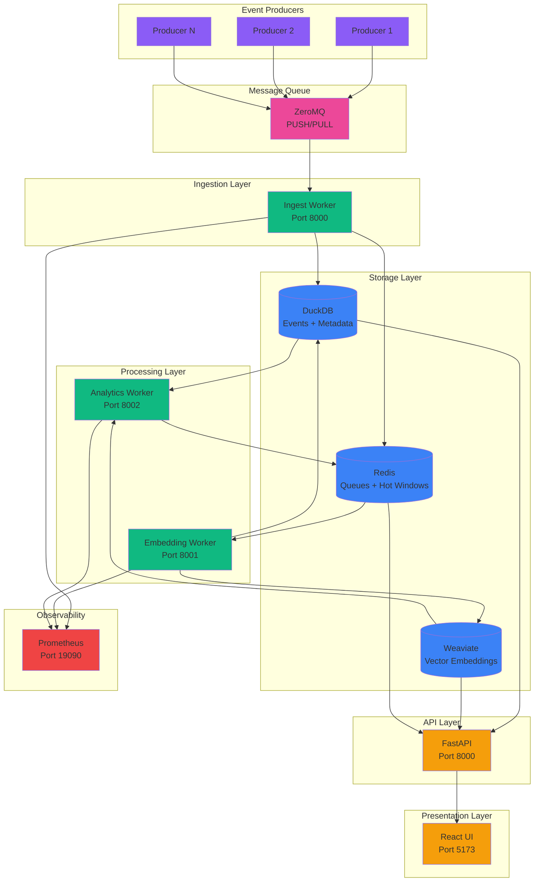
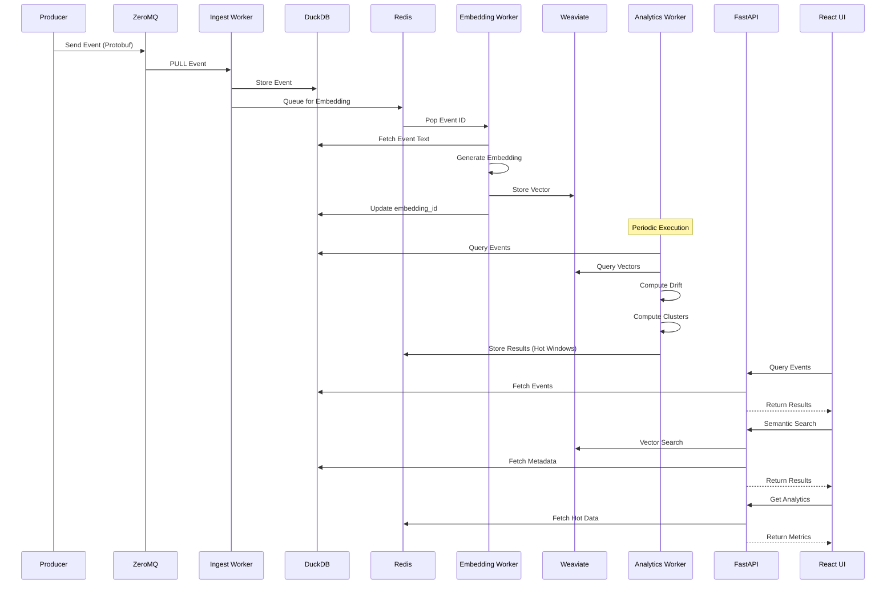
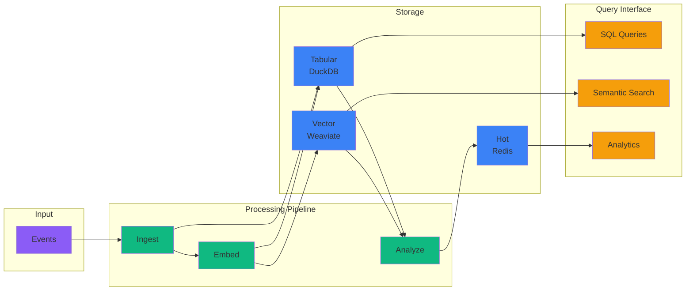

# TVOS Architecture

## System Architecture

```mermaid
graph TB
    subgraph "Event Producers"
        P1[Producer 1]
        P2[Producer 2]
        P3[Producer N]
    end
    
    subgraph "Message Queue"
        ZMQ[ZeroMQ<br/>PUSH/PULL]
    end
    
    subgraph "Ingestion Layer"
        IW[Ingest Worker<br/>Port 8000]
    end
    
    subgraph "Storage Layer"
        DB[(DuckDB<br/>Events + Metadata)]
        WV[(Weaviate<br/>Vector Embeddings)]
        RD[(Redis<br/>Queues + Hot Windows)]
    end
    
    subgraph "Processing Layer"
        EW[Embedding Worker<br/>Port 8001]
        AW[Analytics Worker<br/>Port 8002]
    end
    
    subgraph "API Layer"
        API[FastAPI<br/>Port 8000]
    end
    
    subgraph "Presentation Layer"
        UI[React UI<br/>Port 5173]
    end
    
    subgraph "Observability"
        PROM[Prometheus<br/>Port 19090]
    end
    
    P1 --> ZMQ
    P2 --> ZMQ
    P3 --> ZMQ
    
    ZMQ --> IW
    
    IW --> DB
    IW --> RD
    IW --> PROM
    
    RD --> EW
    EW --> WV
    EW --> DB
    EW --> PROM
    
    DB --> AW
    WV --> AW
    AW --> RD
    AW --> PROM
    
    DB --> API
    WV --> API
    RD --> API
    
    API --> UI
    
    style P1 fill:#8b5cf6
    style P2 fill:#8b5cf6
    style P3 fill:#8b5cf6
    style ZMQ fill:#ec4899
    style IW fill:#10b981
    style EW fill:#10b981
    style AW fill:#10b981
    style DB fill:#3b82f6
    style WV fill:#3b82f6
    style RD fill:#3b82f6
    style API fill:#f59e0b
    style UI fill:#f59e0b
    style PROM fill:#ef4444
```

## Data Flow

```mermaid
sequenceDiagram
    participant P as Producer
    participant Z as ZeroMQ
    participant I as Ingest Worker
    participant D as DuckDB
    participant R as Redis
    participant E as Embedding Worker
    participant W as Weaviate
    participant A as Analytics Worker
    participant API as FastAPI
    participant UI as React UI
    
    P->>Z: Send Event (Protobuf)
    Z->>I: PULL Event
    I->>D: Store Event
    I->>R: Queue for Embedding
    
    R->>E: Pop Event ID
    E->>D: Fetch Event Text
    E->>E: Generate Embedding
    E->>W: Store Vector
    E->>D: Update embedding_id
    
    Note over A: Periodic Execution
    A->>D: Query Events
    A->>W: Query Vectors
    A->>A: Compute Drift
    A->>A: Compute Clusters
    A->>R: Store Results (Hot Windows)
    
    UI->>API: Query Events
    API->>D: Fetch Events
    API-->>UI: Return Results
    
    UI->>API: Semantic Search
    API->>W: Vector Search
    API->>D: Fetch Metadata
    API-->>UI: Return Results
    
    UI->>API: Get Analytics
    API->>R: Fetch Hot Data
    API-->>UI: Return Metrics
```

## Component Interaction

```mermaid
graph LR
    subgraph "Input"
        E[Events]
    end
    
    subgraph "Processing Pipeline"
        I[Ingest]
        EM[Embed]
        A[Analyze]
    end
    
    subgraph "Storage"
        T[Tabular<br/>DuckDB]
        V[Vector<br/>Weaviate]
        H[Hot<br/>Redis]
    end
    
    subgraph "Query Interface"
        SQL[SQL Queries]
        SEM[Semantic Search]
        AN[Analytics]
    end
    
    E --> I
    I --> T
    I --> EM
    EM --> V
    EM --> T
    T --> A
    V --> A
    A --> H
    
    T --> SQL
    V --> SEM
    H --> AN
    
    style E fill:#8b5cf6
    style I fill:#10b981
    style EM fill:#10b981
    style A fill:#10b981
    style T fill:#3b82f6
    style V fill:#3b82f6
    style H fill:#3b82f6
    style SQL fill:#f59e0b
    style SEM fill:#f59e0b
    style AN fill:#f59e0b
```
